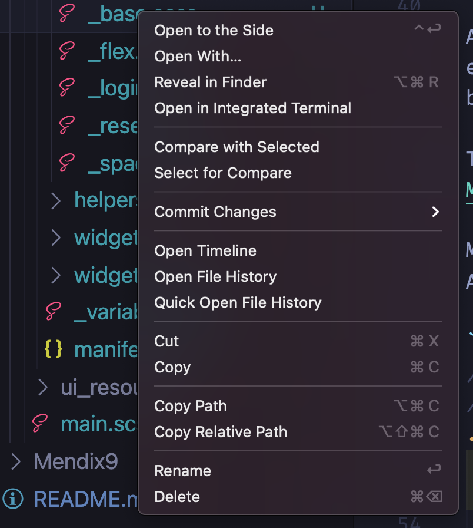
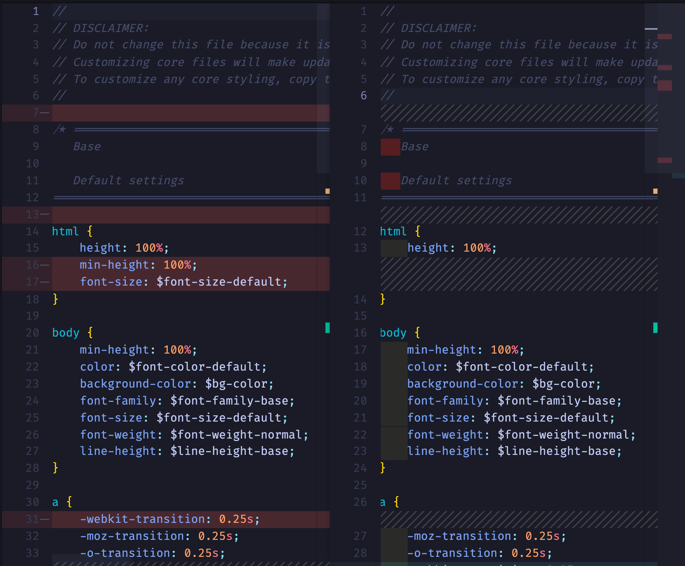

# Minimal | Clean Mendix SCSS Core

### Folders

- Mendix 8

  - Clean: Cleanup Version of Core.
  - Standard: Standard Version of Core as extracted from a New Mx8 project

- Mendix 9 contains a version of the Mendix 8 core but with a 'cleaned' up folder structure

## How it was done

A Mendix 8 project as created and the core was edited to remove some design code and very specific selectors that make it near imposable to override styling without using `!important` , the feeling was that the core must put down a basic structure but not provide design specific code. We also removed some bad practice code as such as `outline:none`

View [this](https://github.com/mendixlabs/clean-core-experiment-app-services/blob/main/Mendix8/sass/main.scss) to see new import order

### New Bootstrap Imports

As the core made changes to copywriten files from Bootstrap we decided to remove them completely and re-import clean examples downloaded directly form the source

## How to see what changed

1. Clone repo
2. Open it in VSCode
3. Select a file lets say: `Mendix8/Clean/core/sass/core/base/_base.scss` right click on it and select "Select for Compare"
4. Then navigate to its corresponding file in Mendix8 Standard, in this case `Mendix9/Standard/core/sass/core/base/_base.scss`, right click the file and select "Compare with Selected"



5. You will see something as below, showing the diff in the files:



Note: You can also use a VSCode extention to compare all the files at once: See [Here](https://marketplace.visualstudio.com/items?itemName=moshfeu.compare-folders)

## Mendix 9

Core Delta is a Mendix 9 version of the "minimal core" from 8.
It also contains the un altered bootstrap files, It has to ship a exclusion variable file to make sure the app excludes/includes tha appropriate files.

An issue here is even though we can specify that Mendix Core Bootstrap shipped by default must be excluded it will still be in the project folder, it is unclear if at build time these files are bundled and shipped with or "treeshook" out.

The image [Theme_Order.png](https://github.com/mendixlabs/clean-core-experiment-app-services/blob/main/Mendix9/Theme_Order.png) shows how developers must order the files.

Mendix 9 core has added code with more specificity as exampled below:
A solution here is to either override very specific or exclude the spacing file.

```scss
// ~/PROJECTNAME/themesource/atlas_core/web/core/base/_spacing.scss
// Scroll container spacing
.mx-scrollcontainer .mx-placeholder {
  width: 100%;
  height: 100%;

  .mx-layoutgrid,
  .mx-layoutgrid-fluid {
    @include layout-spacing(
      $type: padding,
      $direction: all,
      $device: responsive
    );

    .mx-layoutgrid,
    .mx-layoutgrid-fluid {
      padding: 0;
    }
  }
}
```
